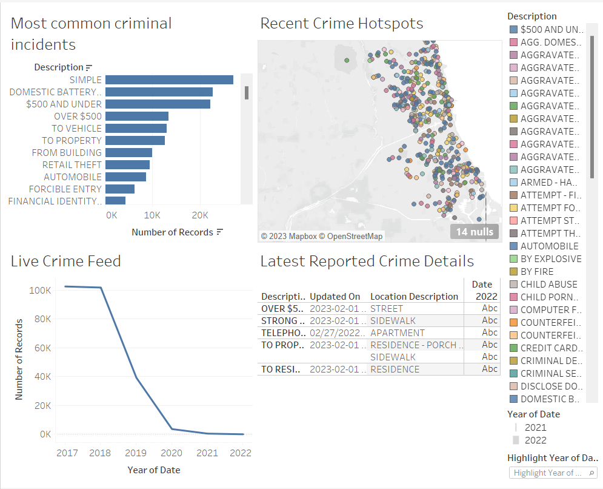

# Crime-Analysis
## Tableau Training
### Course-End Project Problem Statement
Problem Scenario: Crime analysis is important for law-and-order maintenance at any place. It helps the police department and law enforcement agencies to identify patterns of crime, which is crucial for the effective planning of a crime prevention program. The purpose of crime data analysis is to support the operations of the police department, like a criminal investigation, apprehension, prosecution, and development of crime prevention and reduction strategies.

Problem objective: As a data scientist, you should prepare a dashboard to keep the police department and the city updated on the statistics of crime events. You are required to create a dashboard/story using tableau for the communication website. Pay attention to data storytelling.

Note: Download Crime data from the course resource section in the LMS. 

Variable Description: 
ID 	Indicates the unique identifier for the record
Case Number 	Indicates the police department's case number, which is unique to the incident
Date 	Indicates the date when the incident occurred. This is sometimes the best estimate
Block 	Is the partially redacted address where the incident occurred, placed on the same block as the actual address
UCR 
Is the Uniform Crime Reporting code, which directly linked to the Primary Type and Description
Primary Type 	Is the primary description of the UCR code
Description 	Indicates the secondary description of the UCR code, a subcategory of the primary description
Location Description 	Is the description of the location where the incident occurred
Arrest 	Indicates whether an arrest was made
Domestic 	Indicates whether the incident was domestic
Beat 
Indicates the beat where the incident occurred, and the beat is the smallest police geographic area
District 
Indicates the police district where the incident occurred
Ward 
Indicates the ward (city council district) where the incident occurred
Community Area 
Indicates the community area where the incident occurred
NIC Code
Indicates the crime classification as National Incident Code
X Coordinate 	Indicates the x coordinate of the location, where the incident occurred in the state plane
Y Coordinate 	Indicates the y coordinate of the location, where the incident occurred in state plane
Year 	Indicates the year the incident occurred
Updated On 	Indicates the date and time the record was last updated
Latitude 	Indicates the latitude of the location, where the incident occurred
Longitude 	Indicates the longitude of the location, where the incident occurred
Location 	Indicates the location, where the incident occurred in a format that allows for the creation of maps and other geographic operations on this data portal

Steps to perform:
###	Overall Crime Statistics Dashboard:
1.	For personnel and resource management, the department needs to understand the count and types of crimes reported across the city. Mark the locations on a geo-map highlighting the locations with recent criminal history.
2.	Identify the most common criminal incidents reported.     
3.	In this introductory dashboard, include a live crime feed to exhibit the total number of crimes reported to date for the current year and the most recently reported crime with their time and locations.

###	Time Period Analysis Dashboard:
Along with locations, the study of crime statistics across time statistics is also crucial for understanding the patterns and planning those preventive strategies. 
a.	Study distribution count of crime incidents across different time periods such as day of the week or hour.
b.	Further explore the percentage of incident reporting for several time blocks (afternoon, evening, early morning, etc.).

###	Trend Analysis Dashboard:
1.	Create a dashboard to study the change in crime rate over different years. 
2.	Compare the change in the incident reporting over the years for the same date and time.

###	Comparative Analysis:
1.	Study the distribution of incidents reported where an arrest was made vs. not.
2.	Identify what percentage of the reported incidents under each incident category are domestic.

###	 To make the dashboard interactive, provide filters for incident type and location in these dashboards for a granular study.

# DASHBOARDS

